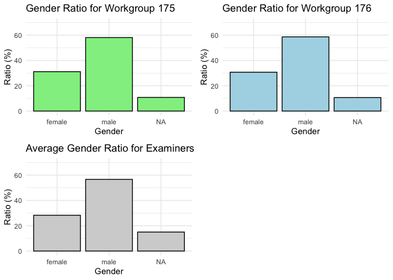
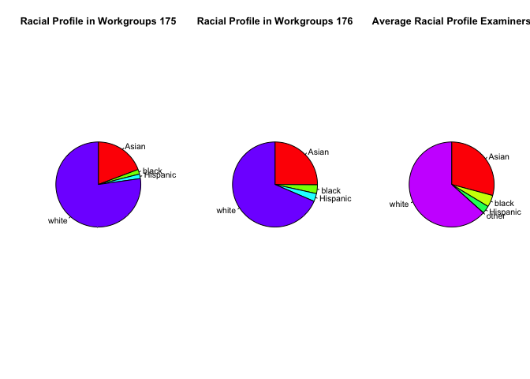
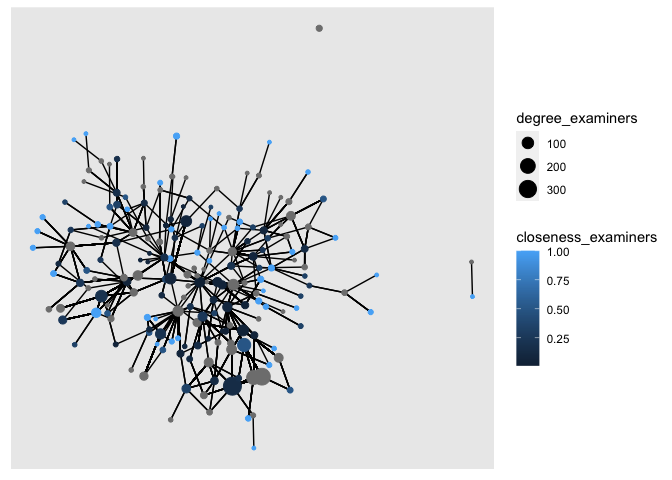

Exercise 4
================
2022-05-30

## Load and attach add-on packages

``` r
library(readr)
library(arrow)
```

    ## 
    ## Attaching package: 'arrow'

    ## The following object is masked from 'package:utils':
    ## 
    ##     timestamp

``` r
require(readr, lib.loc = NULL, quietly = FALSE,
        warn.conflicts,
        character.only = FALSE,
        mask.ok, exclude, include.only,
        attach.required = missing(include.only))
require(arrow, lib.loc = NULL, quietly = FALSE,
        warn.conflicts,
        character.only = FALSE,
        mask.ok, exclude, include.only,
        attach.required = missing(include.only))
```

\#Load the files and add the following variables for examiners: Load the
following data: applications from `app_data_sample.parquet` + edges from
`edges_sample.csv`

``` r
applications <- read_parquet("/Users/justinenadeau-routhier/myrepo/myrepo/app_data_sample.parquet")
edges <- read_csv("/Users/justinenadeau-routhier/myrepo/myrepo/edges_sample.csv")
```

    ## Rows: 32906 Columns: 4
    ## ── Column specification ────────────────────────────────────────────────────────
    ## Delimiter: ","
    ## chr  (1): application_number
    ## dbl  (2): ego_examiner_id, alter_examiner_id
    ## date (1): advice_date
    ## 
    ## ℹ Use `spec()` to retrieve the full column specification for this data.
    ## ℹ Specify the column types or set `show_col_types = FALSE` to quiet this message.

``` r
applications
```

    ## # A tibble: 2,018,477 × 16
    ##    application_number filing_date examiner_name_last examiner_name_first
    ##    <chr>              <date>      <chr>              <chr>              
    ##  1 08284457           2000-01-26  HOWARD             JACQUELINE         
    ##  2 08413193           2000-10-11  YILDIRIM           BEKIR              
    ##  3 08531853           2000-05-17  HAMILTON           CYNTHIA            
    ##  4 08637752           2001-07-20  MOSHER             MARY               
    ##  5 08682726           2000-04-10  BARR               MICHAEL            
    ##  6 08687412           2000-04-28  GRAY               LINDA              
    ##  7 08716371           2004-01-26  MCMILLIAN          KARA               
    ##  8 08765941           2000-06-23  FORD               VANESSA            
    ##  9 08776818           2000-02-04  STRZELECKA         TERESA             
    ## 10 08809677           2002-02-20  KIM                SUN                
    ## # … with 2,018,467 more rows, and 12 more variables:
    ## #   examiner_name_middle <chr>, examiner_id <dbl>, examiner_art_unit <dbl>,
    ## #   uspc_class <chr>, uspc_subclass <chr>, patent_number <chr>,
    ## #   patent_issue_date <date>, abandon_date <date>, disposal_type <chr>,
    ## #   appl_status_code <dbl>, appl_status_date <chr>, tc <dbl>

``` r
edges
```

    ## # A tibble: 32,906 × 4
    ##    application_number advice_date ego_examiner_id alter_examiner_id
    ##    <chr>              <date>                <dbl>             <dbl>
    ##  1 09402488           2008-11-17            84356             66266
    ##  2 09402488           2008-11-17            84356             63519
    ##  3 09402488           2008-11-17            84356             98531
    ##  4 09445135           2008-08-21            92953             71313
    ##  5 09445135           2008-08-21            92953             93865
    ##  6 09445135           2008-08-21            92953             91818
    ##  7 09479304           2008-12-15            61767             69277
    ##  8 09479304           2008-12-15            61767             92446
    ##  9 09479304           2008-12-15            61767             66805
    ## 10 09479304           2008-12-15            61767             70919
    ## # … with 32,896 more rows

## Add the Gender variable for examiners:

``` r
library(gender)
library(dplyr)
```

    ## 
    ## Attaching package: 'dplyr'

    ## The following objects are masked from 'package:stats':
    ## 
    ##     filter, lag

    ## The following objects are masked from 'package:base':
    ## 
    ##     intersect, setdiff, setequal, union

``` r
# List of examiner first names without repetitions
examiner_names <- applications %>%
  distinct(examiner_name_first)

examiner_names
```

    ## # A tibble: 2,595 × 1
    ##    examiner_name_first
    ##    <chr>              
    ##  1 JACQUELINE         
    ##  2 BEKIR              
    ##  3 CYNTHIA            
    ##  4 MARY               
    ##  5 MICHAEL            
    ##  6 LINDA              
    ##  7 KARA               
    ##  8 VANESSA            
    ##  9 TERESA             
    ## 10 SUN                
    ## # … with 2,585 more rows

## Get a table of examiner names and gender:

``` r
library(purrr)
library (dplyr)
library(tidytext)
library(tidyr)

examiner_names_gender <- examiner_names %>%
  do(results = gender(.$examiner_name_first, method = "ssa")) %>%
  unnest(cols = c(results), keep_empty = TRUE) %>%
  select(
    examiner_name_first = name,
    gender,
    proportion_female)

examiner_names_gender
```

    ## # A tibble: 1,822 × 3
    ##    examiner_name_first gender proportion_female
    ##    <chr>               <chr>              <dbl>
    ##  1 AARON               male              0.0082
    ##  2 ABDEL               male              0     
    ##  3 ABDOU               male              0     
    ##  4 ABDUL               male              0     
    ##  5 ABDULHAKIM          male              0     
    ##  6 ABDULLAH            male              0     
    ##  7 ABDULLAHI           male              0     
    ##  8 ABIGAIL             female            0.998 
    ##  9 ABIMBOLA            female            0.944 
    ## 10 ABRAHAM             male              0.0031
    ## # … with 1,812 more rows

## Join table back to original applications data and discard the temporary tables we have just created to reduce clutter in our environment

``` r
# remove extra colums from the gender table
examiner_names_gender <- examiner_names_gender %>% 
  select(examiner_name_first, gender)

# joining gender back to the dataset
applications <- applications %>% 
  left_join(examiner_names_gender, by = "examiner_name_first")

# cleaning up
rm(examiner_names)
rm(examiner_names_gender)
gc()
```

    ##            used  (Mb) gc trigger  (Mb) limit (Mb) max used  (Mb)
    ## Ncells  5438437 290.5   10983188 586.6         NA  7505542 400.9
    ## Vcells 51264463 391.2   97528404 744.1     102400 81580271 622.5

## Join the data back to the applications table

## Add the Race variable for examiners:

``` r
library(wru)

# List of examiner surnames without repetitions
examiner_surnames <- applications %>% 
  select(surname = examiner_name_last) %>% 
  distinct()

examiner_surnames
```

    ## # A tibble: 3,806 × 1
    ##    surname   
    ##    <chr>     
    ##  1 HOWARD    
    ##  2 YILDIRIM  
    ##  3 HAMILTON  
    ##  4 MOSHER    
    ##  5 BARR      
    ##  6 GRAY      
    ##  7 MCMILLIAN 
    ##  8 FORD      
    ##  9 STRZELECKA
    ## 10 KIM       
    ## # … with 3,796 more rows

``` r
# Estimate likely race of an examiner and get probability across five broad US Census categories: white, black, Hispanic, Asian and other
examiner_race <- predict_race(voter.file = examiner_surnames, surname.only = T) %>% 
  as_tibble()
```

    ## [1] "Proceeding with surname-only predictions..."

    ## Warning in merge_surnames(voter.file): Probabilities were imputed for 698
    ## surnames that could not be matched to Census list.

``` r
examiner_race
```

    ## # A tibble: 3,806 × 6
    ##    surname    pred.whi pred.bla pred.his pred.asi pred.oth
    ##    <chr>         <dbl>    <dbl>    <dbl>    <dbl>    <dbl>
    ##  1 HOWARD       0.643   0.295    0.0237   0.005     0.0333
    ##  2 YILDIRIM     0.861   0.0271   0.0609   0.0135    0.0372
    ##  3 HAMILTON     0.702   0.237    0.0245   0.0054    0.0309
    ##  4 MOSHER       0.947   0.00410  0.0241   0.00640   0.0185
    ##  5 BARR         0.827   0.117    0.0226   0.00590   0.0271
    ##  6 GRAY         0.687   0.251    0.0241   0.0054    0.0324
    ##  7 MCMILLIAN    0.359   0.574    0.0189   0.00260   0.0463
    ##  8 FORD         0.620   0.32     0.0237   0.0045    0.0313
    ##  9 STRZELECKA   0.666   0.0853   0.137    0.0797    0.0318
    ## 10 KIM          0.0252  0.00390  0.00650  0.945     0.0198
    ## # … with 3,796 more rows

``` r
# Pick the race category that has the highest probability for each last name and then join the table back to the main applications table
examiner_race <- examiner_race %>% 
  mutate(max_race_p = pmax(pred.asi, pred.bla, pred.his, pred.oth, pred.whi)) %>% 
  mutate(race = case_when(
    max_race_p == pred.asi ~ "Asian",
    max_race_p == pred.bla ~ "black",
    max_race_p == pred.his ~ "Hispanic",
    max_race_p == pred.oth ~ "other",
    max_race_p == pred.whi ~ "white",
    TRUE ~ NA_character_))

examiner_race
```

    ## # A tibble: 3,806 × 8
    ##    surname    pred.whi pred.bla pred.his pred.asi pred.oth max_race_p race 
    ##    <chr>         <dbl>    <dbl>    <dbl>    <dbl>    <dbl>      <dbl> <chr>
    ##  1 HOWARD       0.643   0.295    0.0237   0.005     0.0333      0.643 white
    ##  2 YILDIRIM     0.861   0.0271   0.0609   0.0135    0.0372      0.861 white
    ##  3 HAMILTON     0.702   0.237    0.0245   0.0054    0.0309      0.702 white
    ##  4 MOSHER       0.947   0.00410  0.0241   0.00640   0.0185      0.947 white
    ##  5 BARR         0.827   0.117    0.0226   0.00590   0.0271      0.827 white
    ##  6 GRAY         0.687   0.251    0.0241   0.0054    0.0324      0.687 white
    ##  7 MCMILLIAN    0.359   0.574    0.0189   0.00260   0.0463      0.574 black
    ##  8 FORD         0.620   0.32     0.0237   0.0045    0.0313      0.620 white
    ##  9 STRZELECKA   0.666   0.0853   0.137    0.0797    0.0318      0.666 white
    ## 10 KIM          0.0252  0.00390  0.00650  0.945     0.0198      0.945 Asian
    ## # … with 3,796 more rows

## Join the data back to the applications table

``` r
# removing extra columns
examiner_race <- examiner_race %>% 
  select(surname,race)

applications <- applications %>% 
  left_join(examiner_race, by = c("examiner_name_last" = "surname"))

rm(examiner_race)
rm(examiner_surnames)
gc()
```

    ##            used  (Mb) gc trigger  (Mb) limit (Mb) max used  (Mb)
    ## Ncells  5862167 313.1   10983188 586.6         NA 10660444 569.4
    ## Vcells 55075916 420.2   97528404 744.1     102400 97448021 743.5

## Add the Tenure variable for examiners:

``` r
library(lubridate) # to work with dates
```

    ## 
    ## Attaching package: 'lubridate'

    ## The following object is masked from 'package:arrow':
    ## 
    ##     duration

    ## The following objects are masked from 'package:base':
    ## 
    ##     date, intersect, setdiff, union

``` r
examiner_dates <- applications %>% 
  select(examiner_id, filing_date, appl_status_date) 

examiner_dates
```

    ## # A tibble: 2,018,477 × 3
    ##    examiner_id filing_date appl_status_date  
    ##          <dbl> <date>      <chr>             
    ##  1       96082 2000-01-26  30jan2003 00:00:00
    ##  2       87678 2000-10-11  27sep2010 00:00:00
    ##  3       63213 2000-05-17  30mar2009 00:00:00
    ##  4       73788 2001-07-20  07sep2009 00:00:00
    ##  5       77294 2000-04-10  19apr2001 00:00:00
    ##  6       68606 2000-04-28  16jul2001 00:00:00
    ##  7       89557 2004-01-26  15may2017 00:00:00
    ##  8       97543 2000-06-23  03apr2002 00:00:00
    ##  9       98714 2000-02-04  27nov2002 00:00:00
    ## 10       65530 2002-02-20  23mar2009 00:00:00
    ## # … with 2,018,467 more rows

``` r
examiner_dates <- examiner_dates %>% 
  mutate(start_date = ymd(filing_date), end_date = as_date(dmy_hms(appl_status_date)))
```

``` r
examiner_dates <- examiner_dates %>% 
  group_by(examiner_id) %>% 
  summarise(
    earliest_date = min(start_date, na.rm = TRUE), 
    latest_date = max(end_date, na.rm = TRUE),
    tenure_days = interval(earliest_date, latest_date) %/% days(1)
    ) %>% 
  filter(year(latest_date)<2018)

examiner_dates
```

    ## # A tibble: 5,625 × 4
    ##    examiner_id earliest_date latest_date tenure_days
    ##          <dbl> <date>        <date>            <dbl>
    ##  1       59012 2004-07-28    2015-07-24         4013
    ##  2       59025 2009-10-26    2017-05-18         2761
    ##  3       59030 2005-12-12    2017-05-22         4179
    ##  4       59040 2007-09-11    2017-05-23         3542
    ##  5       59052 2001-08-21    2007-02-28         2017
    ##  6       59054 2000-11-10    2016-12-23         5887
    ##  7       59055 2004-11-02    2007-12-26         1149
    ##  8       59056 2000-03-24    2017-05-22         6268
    ##  9       59074 2000-01-31    2017-03-17         6255
    ## 10       59081 2011-04-21    2017-05-19         2220
    ## # … with 5,615 more rows

## Join the data back to the applications table

``` r
applications <- applications %>% 
  left_join(examiner_dates, by = "examiner_id")

rm(examiner_dates)
gc()
```

    ##            used  (Mb) gc trigger   (Mb) limit (Mb)  max used   (Mb)
    ## Ncells  5956841 318.2   16186346  864.5         NA  16186346  864.5
    ## Vcells 67572648 515.6  168820280 1288.0     102400 140419080 1071.4

``` r
head(applications)
```

    ## # A tibble: 6 × 21
    ##   application_number filing_date examiner_name_last examiner_name_first
    ##   <chr>              <date>      <chr>              <chr>              
    ## 1 08284457           2000-01-26  HOWARD             JACQUELINE         
    ## 2 08413193           2000-10-11  YILDIRIM           BEKIR              
    ## 3 08531853           2000-05-17  HAMILTON           CYNTHIA            
    ## 4 08637752           2001-07-20  MOSHER             MARY               
    ## 5 08682726           2000-04-10  BARR               MICHAEL            
    ## 6 08687412           2000-04-28  GRAY               LINDA              
    ## # … with 17 more variables: examiner_name_middle <chr>, examiner_id <dbl>,
    ## #   examiner_art_unit <dbl>, uspc_class <chr>, uspc_subclass <chr>,
    ## #   patent_number <chr>, patent_issue_date <date>, abandon_date <date>,
    ## #   disposal_type <chr>, appl_status_code <dbl>, appl_status_date <chr>,
    ## #   tc <dbl>, gender <chr>, race <chr>, earliest_date <date>,
    ## #   latest_date <date>, tenure_days <dbl>

# Pick two workgroups to focus on (represented by the first 3 digits of `examiner_art_unit` value): 175 and 176

``` r
colummn_7 <- applications %>% select(examiner_art_unit)

#Select the first two workgroups: 175 and 176
head(unique(colummn_7),2) 
```

    ## # A tibble: 2 × 1
    ##   examiner_art_unit
    ##               <dbl>
    ## 1              1764
    ## 2              1752

## List examiners from the two selected workgroups (175 and 176)

``` r
# String staring from the 1st number to 3rd number is extracted as a substring
workgroup_175 = applications[substr(applications$examiner_art_unit, 1,3)==175,]
workgroup_176 = applications[substr(applications$examiner_art_unit, 1,3)==176,]

head(workgroup_175)
```

    ## # A tibble: 6 × 21
    ##   application_number filing_date examiner_name_last examiner_name_first
    ##   <chr>              <date>      <chr>              <chr>              
    ## 1 08531853           2000-05-17  HAMILTON           CYNTHIA            
    ## 2 08836939           2000-06-13  WOOD               ELIZABETH          
    ## 3 08945309           2000-06-15  STARSIAK           JOHN               
    ## 4 08994479           2001-01-30  BOYER              CHARLES            
    ## 5 09242809           2000-02-10  EINSMANN           MARGARET           
    ## 6 09254729           2000-04-14  HARDEE             JOHN               
    ## # … with 17 more variables: examiner_name_middle <chr>, examiner_id <dbl>,
    ## #   examiner_art_unit <dbl>, uspc_class <chr>, uspc_subclass <chr>,
    ## #   patent_number <chr>, patent_issue_date <date>, abandon_date <date>,
    ## #   disposal_type <chr>, appl_status_code <dbl>, appl_status_date <chr>,
    ## #   tc <dbl>, gender <chr>, race <chr>, earliest_date <date>,
    ## #   latest_date <date>, tenure_days <dbl>

``` r
head(workgroup_176)
```

    ## # A tibble: 6 × 21
    ##   application_number filing_date examiner_name_last examiner_name_first
    ##   <chr>              <date>      <chr>              <chr>              
    ## 1 08284457           2000-01-26  HOWARD             JACQUELINE         
    ## 2 08413193           2000-10-11  YILDIRIM           BEKIR              
    ## 3 08682726           2000-04-10  BARR               MICHAEL            
    ## 4 09101427           2000-09-16  BARR               MICHAEL            
    ## 5 09180120           2000-04-05  WONG               LESLIE             
    ## 6 09230364           2000-02-09  NECKEL             ALEXA              
    ## # … with 17 more variables: examiner_name_middle <chr>, examiner_id <dbl>,
    ## #   examiner_art_unit <dbl>, uspc_class <chr>, uspc_subclass <chr>,
    ## #   patent_number <chr>, patent_issue_date <date>, abandon_date <date>,
    ## #   disposal_type <chr>, appl_status_code <dbl>, appl_status_date <chr>,
    ## #   tc <dbl>, gender <chr>, race <chr>, earliest_date <date>,
    ## #   latest_date <date>, tenure_days <dbl>

## Show how the two workgroups (175 and 176) compare on examiners’ demographics (summary statistics about gender)

``` r
# Calculate gender ratio in the workgroups 175
round(table(workgroup_175['gender'])/dim(workgroup_175)[1]*100,2)
```

    ## gender
    ## female   male 
    ##  31.13  58.08

From the output we can observe: 31.13% of examiners in the workgroup 175
are female and 58.08% of examiners in the workgroup 175 are male.
Therefore, the workgroup 175 is significantly male-dominated.

``` r
# Calculate gender ratio in the workgroups 176
round(table(workgroup_176['gender'])/dim(workgroup_176)[1]*100,2)
```

    ## gender
    ## female   male 
    ##  30.72  58.62

From the output we can observe: 30.72% of examiners in the workgroup 176
are female and 58.62% of examiners in the workgroup 176 are males.
Therefore, the workgroup 176 is significantly male-dominated.

``` r
# Calculate average gender ratio in the applications table (as a reference)
round(table(applications['gender'])/dim(applications)[1]*100,2)
```

    ## gender
    ## female   male 
    ##  28.30  56.65

From the output we can observe: 28.30% of examiners in the applications
table are female and 56.65% of examiners in the applications table are
males. Therefore, the average examiners is significantly male-dominated.

## Show how the two workgroups (175 and 176) compare on examiners’ demographics (summary plots about gender)

``` r
library(gridExtra)
```

    ## 
    ## Attaching package: 'gridExtra'

    ## The following object is masked from 'package:dplyr':
    ## 
    ##     combine

``` r
library(tidyverse)
```

    ## ── Attaching packages ─────────────────────────────────────── tidyverse 1.3.1 ──

    ## ✔ ggplot2 3.3.6     ✔ stringr 1.4.0
    ## ✔ tibble  3.1.6     ✔ forcats 0.5.1

    ## ── Conflicts ────────────────────────────────────────── tidyverse_conflicts() ──
    ## ✖ lubridate::as.difftime() masks base::as.difftime()
    ## ✖ gridExtra::combine()     masks dplyr::combine()
    ## ✖ lubridate::date()        masks base::date()
    ## ✖ lubridate::duration()    masks arrow::duration()
    ## ✖ dplyr::filter()          masks stats::filter()
    ## ✖ lubridate::intersect()   masks base::intersect()
    ## ✖ dplyr::lag()             masks stats::lag()
    ## ✖ lubridate::setdiff()     masks base::setdiff()
    ## ✖ lubridate::union()       masks base::union()

``` r
plot_gender_175 <- ggplot(data=workgroup_175, aes(x=gender)) +
  geom_bar(aes(y = (..count..)/sum(..count..)*100),color="black",fill="light green") + 
  theme_minimal() +
  ylab("Ratio (%)")+
  xlab("Gender")+
  ylim(0,70)+
  ggtitle(paste0("Gender Ratio for Workgroup 175"))

plot_gender_176 <- ggplot(data=workgroup_176, aes(x=gender)) +
  geom_bar(aes(y = (..count..)/sum(..count..)*100),color="black",fill="light blue") +
  theme_minimal() +
  ylab("Ratio (%)")+
  xlab("Gender")+
  ylim(0,70)+
  ggtitle(paste0("Gender Ratio for Workgroup 176"))

plot_gender_avg <- ggplot(data=applications['gender'], aes(x=gender)) +
  geom_bar(aes(y = (..count..)/sum(..count..)*100),color="black",fill="light grey") +
  theme_minimal() +
  ylab("Ratio (%)")+
  xlab("Gender")+
  ylim(0,70)+
  ggtitle(paste0("Average Gender Ratio for Examiners"))

grid.arrange(plot_gender_175,plot_gender_176,plot_gender_avg,widths=c(1,1))
```

<!-- -->

## Show how the two workgroups (175 and 176) compare on examiners’ demographics (summary statistics about race)

``` r
# Determine racial profile in the workgroups 175
race_175 <- round(table(workgroup_175['race'])/dim(workgroup_175)[1]*100,2)
race_175
```

    ## race
    ##    Asian    black Hispanic    white 
    ##    19.27     1.79     1.71    77.23

From the output we can observe: 19.27% of examiners in the workgroup 175
are Asian, 1.79% of examiners in the workgroup 175 are black, 1.71% of
examiners in the workgroup 175 are Hispanic, and 77.23% of examiners in
the workgroup 175 are white. Therefore, the workgroup 175 is
significantly white-dominated.

``` r
# Determine racial profile in the workgroups 176
race_176 <- round(table(workgroup_176['race'])/dim(workgroup_176)[1]*100,2)
race_176
```

    ## race
    ##    Asian    black Hispanic    white 
    ##    25.11     3.35     3.01    68.53

From the output we can observe: 25.11% of examiners in the workgroup 176
are Asian, 3.35% of examiners in the workgroup 176 are black, 3.01% of
examiners in the workgroup 176 are Hispanic, and 68.53% of examiners in
the workgroup 176 are white. Therefore, the workgroup 176 is
significantly white-dominated.

``` r
# Determine racial profile in the applications table (as a reference)
race_avg <- round(table(applications['race'])/dim(applications)[1]*100,2)
race_avg
```

    ## race
    ##    Asian    black Hispanic    other    white 
    ##    29.18     4.46     2.96     0.02    63.38

From the output we can observe: 29.18% of examiners in the workgroup 175
are Asian, 4.46% of examiners in the workgroup 175 are black, 2.96% of
examiners in the workgroup 175 are Hispanic, 63.38% of examiners in the
workgroup 175 are white, and 0.02% of examiners in the workgroup 175 are
a member of another race.Therefore, the average examiners is
significantly white-dominated.

## Show how the two workgroups (175 and 176) compare on examiners’ demographics (summary plots about race)

``` r
library(gridExtra)
library(tidyverse)

par(mfrow=c(1,3)) 
lbls <- c("Asian", "black", "Hispanic", "white")
lbls_o <- c("Asian", "black", "Hispanic", "other", "white")

plot_race_175 <- pie(race_175,labels = lbls, col=rainbow(length(race_175)),main = "Racial Profile in Workgroups 175",clockwise = TRUE)

plot_race_176 <- pie(race_176,labels = lbls, col=rainbow(length(race_175)),main = "Racial Profile in Workgroups 176",clockwise = TRUE)

plot_race_avg <- pie(race_avg,labels = lbls_o, col=rainbow(length(race_avg)),main = "Average Racial Profile Examiners",clockwise = TRUE)
```

<!-- -->

# Create advice advice_networks from `edges_sample`

``` r
library(dplyr)
library(tidygraph) 
```

    ## 
    ## Attaching package: 'tidygraph'

    ## The following object is masked from 'package:stats':
    ## 
    ##     filter

``` r
# Identify the workgroups of interest
art_unit = distinct(subset(applications, select=c(examiner_art_unit, examiner_id)))

# Add workgroups to use  as an indicator in the graph and select the groups of interest
art_unit$work_group = substr(art_unit$examiner_art_unit, 1,3)
art_unit = art_unit[art_unit$work_group==175 | art_unit$work_group==176,]

# Merge
merger = merge(x=edges, y=art_unit, by.x="ego_examiner_id", by.y="examiner_id", all.x=TRUE) %>% rename(art_unit_ego = examiner_art_unit, work_group_ego=work_group)

# Drop the NA values (other groups than 175 or 176)
merger = drop_na(merger)

# Repete for the alters
merger = merge(x=merger, y=art_unit, by.x="alter_examiner_id", by.y="examiner_id", all.x=TRUE)%>% rename(art_unit_alter = examiner_art_unit, work_group_alter=work_group)

merger = drop_na(merger)
```

There are 1651 edges left representing examiners from the workgroups 175
and 176.

``` r
# Define focal nodes ("egos") and the nodes to whom egos are directly connected to ("alters") to build the Ego advice_networks
library(igraph)
```

    ## 
    ## Attaching package: 'igraph'

    ## The following object is masked from 'package:tidygraph':
    ## 
    ##     groups

    ## The following object is masked from 'package:tibble':
    ## 
    ##     as_data_frame

    ## The following objects are masked from 'package:lubridate':
    ## 
    ##     %--%, union

    ## The following object is masked from 'package:tidyr':
    ## 
    ##     crossing

    ## The following objects are masked from 'package:purrr':
    ## 
    ##     compose, simplify

    ## The following objects are masked from 'package:dplyr':
    ## 
    ##     as_data_frame, groups, union

    ## The following objects are masked from 'package:stats':
    ## 
    ##     decompose, spectrum

    ## The following object is masked from 'package:base':
    ## 
    ##     union

``` r
egos = subset(merger, select=c(ego_examiner_id, art_unit_ego, work_group_ego)) 
egos = egos %>% rename(examiner_id=ego_examiner_id,art_unit=art_unit_ego,work_group=work_group_ego)

nodes = subset(merger, select=c(alter_examiner_id, art_unit_alter, work_group_alter)) 
nodes = nodes %>% rename(examiner_id=alter_examiner_id,art_unit=art_unit_alter, work_group=work_group_alter)

nodes = distinct(rbind(egos, nodes)) %>% group_by(examiner_id) %>% summarise(examiner_id = first(examiner_id), art_unit = first(art_unit), work_group = first(work_group))

# Creates an igraph graph from two data frames containing the edge list and edge/vertex attributes
advice_network <- graph_from_data_frame(merger, directed=TRUE, vertices=nodes)
print(advice_network, e=TRUE, v=TRUE)
```

    ## IGRAPH cfd7fca DN-- 192 1651 -- 
    ## + attr: name (v/c), art_unit (v/n), work_group (v/c),
    ## | application_number (e/c), advice_date (e/n), art_unit_ego (e/n),
    ## | work_group_ego (e/c), art_unit_alter (e/n), work_group_alter (e/c)
    ## + edges from cfd7fca (vertex names):
    ##  [1] 59706->66436 59706->66436 59706->66436 59816->71143 59816->71143
    ##  [6] 59816->71143 59816->71143 59870->59165 59870->59165 59975->94301
    ## [11] 59975->71142 59975->94301 59975->95799 59975->71142 59975->92487
    ## [16] 59975->94301 59975->94301 59975->95799 59975->71142 59975->92487
    ## [21] 59975->63366 59975->71142 59975->94301 59975->92487 59975->92487
    ## [26] 60203->94782 60203->94782 60203->94782 60203->94782 60203->94782
    ## + ... omitted several edges

``` r
library(ggraph)
# Calculate centrality scores in selected workgroups
# degree centrality (number of edges connected to it)
degree_examiners <- round(degree(advice_network, v=V(advice_network)),2)
# closeness centrality (mean distance from a node to other nodes)
closeness_examiners <- round(closeness(advice_network),2)
# betweenness centrality (extent to which a node lies on paths between other nodes) 
betweenness_examiners <- round(betweenness(advice_network),2) 

V(advice_network)$size = degree_examiners
V(advice_network)$bet = betweenness_examiners
V(advice_network)$clo = closeness_examiners
V(advice_network)$color = nodes$art_unit

ggraph(advice_network, layout="kk") +
  geom_edge_link()+
  geom_node_point(aes(size = degree_examiners, colour = closeness_examiners))
```

<!-- -->

``` r
  coord_fixed()
```

    ## <ggproto object: Class CoordFixed, CoordCartesian, Coord, gg>
    ##     aspect: function
    ##     backtransform_range: function
    ##     clip: on
    ##     default: FALSE
    ##     distance: function
    ##     expand: TRUE
    ##     is_free: function
    ##     is_linear: function
    ##     labels: function
    ##     limits: list
    ##     modify_scales: function
    ##     range: function
    ##     ratio: 1
    ##     render_axis_h: function
    ##     render_axis_v: function
    ##     render_bg: function
    ##     render_fg: function
    ##     setup_data: function
    ##     setup_layout: function
    ##     setup_panel_guides: function
    ##     setup_panel_params: function
    ##     setup_params: function
    ##     train_panel_guides: function
    ##     transform: function
    ##     super:  <ggproto object: Class CoordFixed, CoordCartesian, Coord, gg>

# Calculate centrality scores for examiners in the selected workgroups

``` r
# Calculate three indices (degree, betweenness and closeness) to the advice_network and 
calculate_centralities = data.frame(cbind(degree_examiners, betweenness_examiners, closeness_examiners))

# Display the top 6 examiners based on calculated centrality indices
head(calculate_centralities[order(-degree_examiners),])
```

    ##       degree_examiners betweenness_examiners closeness_examiners
    ## 67829              336                     0                0.14
    ## 94782              280                     0                 NaN
    ## 93968              174                     0                 NaN
    ## 60203              147                    11                0.50
    ## 84157              102                     0                0.20
    ## 62499               86                     0                0.04

It can be observed that the `examiner 67829` has the highest degree of
centrality and the highest associated closeness. The `examiner 60203`
should also be considered due to it’s high betweenness, combined with a
high degree of centrality. The relationship between centrality and other
examiners’ characteristics has yet to be determined graphically.

# Create variable for application processing time ‘app_proc_time’ that measures the number of days (or weeks) from application filing date, until the final decision on it (patented or abandoned)

## Final decision date is computed as either abandon date or patent issue date

``` r
library(dplyr)
library(tidyselect)
application_time <- applications %>% 
    mutate(decision_date = coalesce(abandon_date,patent_issue_date)) %>%
    select(application_number,filing_date, abandon_date, patent_issue_date, decision_date, examiner_id, examiner_art_unit, gender, race, tenure_days) %>%
    filter(!is.na(decision_date))

head(application_time)
```

    ## # A tibble: 6 × 10
    ##   application_number filing_date abandon_date patent_issue_date decision_date
    ##   <chr>              <date>      <date>       <date>            <date>       
    ## 1 08284457           2000-01-26  NA           2003-02-18        2003-02-18   
    ## 2 08413193           2000-10-11  NA           2002-08-27        2002-08-27   
    ## 3 08531853           2000-05-17  NA           1997-03-04        1997-03-04   
    ## 4 08637752           2001-07-20  NA           2005-08-09        2005-08-09   
    ## 5 08682726           2000-04-10  2000-12-27   NA                2000-12-27   
    ## 6 08687412           2000-04-28  NA           2001-07-31        2001-07-31   
    ## # … with 5 more variables: examiner_id <dbl>, examiner_art_unit <dbl>,
    ## #   gender <chr>, race <chr>, tenure_days <dbl>

## Calculate the application processing time as the difference between filing date and final decision date

``` r
application_time <- application_time %>% 
    mutate(app_proc_time = difftime(decision_date, filing_date, units = "days"))

head(application_time)
```

    ## # A tibble: 6 × 11
    ##   application_number filing_date abandon_date patent_issue_date decision_date
    ##   <chr>              <date>      <date>       <date>            <date>       
    ## 1 08284457           2000-01-26  NA           2003-02-18        2003-02-18   
    ## 2 08413193           2000-10-11  NA           2002-08-27        2002-08-27   
    ## 3 08531853           2000-05-17  NA           1997-03-04        1997-03-04   
    ## 4 08637752           2001-07-20  NA           2005-08-09        2005-08-09   
    ## 5 08682726           2000-04-10  2000-12-27   NA                2000-12-27   
    ## 6 08687412           2000-04-28  NA           2001-07-31        2001-07-31   
    ## # … with 6 more variables: examiner_id <dbl>, examiner_art_unit <dbl>,
    ## #   gender <chr>, race <chr>, tenure_days <dbl>, app_proc_time <drtn>

# Estimate the relationship between centrality and `app_proc_time`

# Calculate average application processing time

``` r
# columns <- c("examiner_id", "gender", "race", "tenure_days", "app_proc_time")
# 
# examiners <- application_time %>%
#     group_by(across(all_of(columns))) %>%
#     dplyr::summarize(avg_app_proc_time = mean(app_proc_time, na.rm=TRUE), n_app = n()) %>%
#     drop_na()
```

# Run linear regression to determine relationship between centrality and app_proc_time

``` r
# lin_reg = lm(application_time,c('app_proc_time') ~ degree_examiners+ betweenness_examiners+ closeness_examiners + race + gender + tenure_days , data=applications)
# summary(lin_reg)
```
